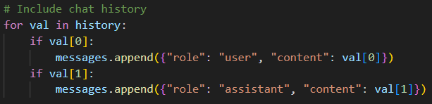
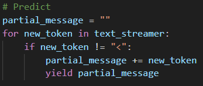
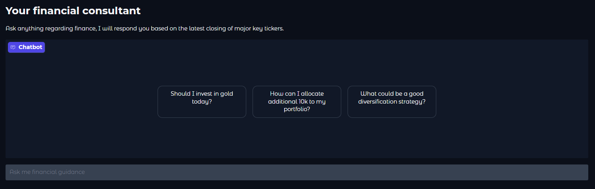

# 🚀 Parameter-Efficient Fine-Tuning (PEFT) of a Large Language Model on a GPU 🌟  

This repository is the codebase for **Lab 2** of KTH's course **ID2223: Scalable Machine Learning and Deep Learning**. Dive into **PEFT** techniques and unleash the power of fine-tuning large language models with limited GPU resources! 💻🔥  

---

## 📚 PEFT Fine-Tuning on a GPU  

### 🔗 [Fine-Tuning Notebook](./peft_finetuning.ipynb)  

This notebook demonstrates fine-tuning the pre-trained model `unsloth/Llama-3.2-1B-Instruct` in **4-bit precision** to reduce memory usage.  

### ✨ Key Highlights:  
- **Model Selection**: The **1B parameter version** was chosen to optimize fine-tuning time, accommodating the limited GPU capacity on **Google Colab's free tier**.  
- **Dataset**: Fine-tuned for **7,900 steps (~half an epoch)** using the [FineTome-100k](https://huggingface.co/datasets/mlabonne/FineTome-100k) dataset, formatted in **HuggingFace's generic format**.  
- **Checkpointing**: Automatic saving every **50 steps** ensures training progress is never lost:  
  ```python  
  trainer_stats = trainer.train(resume_from_checkpoint=True)  
  ```  
- **Model Upload**: The fine-tuned model is available on HuggingFace:  
  [👉 jackma-00/lora_model_1b](https://huggingface.co/jackma-00/lora_model_1b).  

### 🧪 Experimentation:  
Use the following notebooks for pre-deployment testing:  
- **[LoRA Inference](./lora_inference.ipynb)**  
- **[Gradio UI](./gradio_ui.ipynb)**  

---

## 🤖 LoRA Model Chatbot  

The chatbot app, built with **Gradio** and deployed on **HuggingFace Spaces**, is in the [LoraModel folder](./LoraModel/).  

### 🔍 Features:  
1. **Interactive Chat History**: Keeps track of your conversation for seamless flow.  
     
2. **Streaming Responses**: Responses generate in real-time for a smooth experience.  
     
3. **Finance Expertise**: A personal **financial advisor chatbot** powered by daily market data.  

### 💡 How It Works:  
- The chatbot leverages the **fine-tuned LoRA model**: `jackma-00/lora_model_1b`.  
- It integrates **daily market data** for tickers like `SPY`, `DIA`, `QQQ`, `IWM`, and `VXX` via the **Polygon API**.  
- Check out the file [daily_tickers.py](./LoraModel/daily_tickers.py) for implementation details.  

### 🖼️ Preview:  
Here’s what the chatbot looks like in action:  

